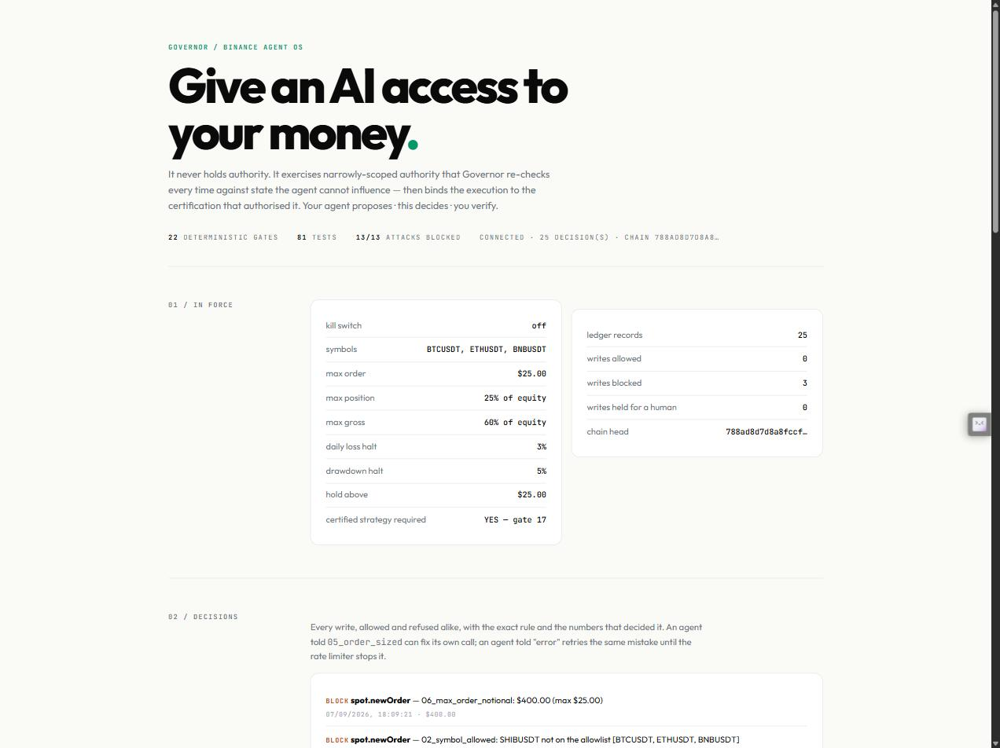

# Governor

## Autonomous trading needs an authority layer.

AI agents can now reach real money on Binance. Permission to trade is not the same thing as proof
that a proposed action is trustworthy — and nothing in the stack currently tells those apart.

Governor sits between the agent and Binance Agent OS, independently decides what may execute, and
then verifies what actually happened.

> **AI proposes. Governor decides. Binance executes. Governor establishes reality.**

|  |  |
|---|---|
| **Strategy integrity** | Does the strategy deserve execution at all? |
| **Execution integrity** | Is the exact authorised action what actually gets sent? |
| **Outcome integrity** | Did the resulting financial state match what was authorised? |

Built for the [Binance Agent OS Mini Hackathon](https://x.com/binance/status/2094810011557838988), Track A.

**[▶ Watch the 90-second demo](https://youtu.be/8d-iS1bJWKM)** · 22 deterministic gates · 90 tests ·
14/14 adversarial attacks blocked · 6/6 judge journeys · MIT

Governor is an MCP server that sits in front of Binance's own Agent OS MCP server. Every read your
agent makes passes straight through, unchanged. Every *write* — every order, cancel, transfer, or
on-chain DeFi action — clears a deterministic policy engine first, is validated by **Binance's own
`spot.orderTest`**, and lands in a hash-chained, Ed25519-signed ledger before it ever reaches the
exchange. And before an agent is allowed to run a strategy at all, a second gate asks whether the
strategy is statistically supported — using Bailey & López de Prado's own Deflated Sharpe Ratio and
Minimum Backtest Length math, not an opinion.

[](https://youtu.be/8d-iS1bJWKM)

That page **is** the product. Live decisions as they happen, a form that fires real orders at the
real gates through your own connected account, and a button that re-derives the entire signed ledger
and checks the signature using nothing but your browser's Web Crypto API. Setup is in
[Reproduce this](#reproduce-this) — six commands.

---

## Built on Binance Agent OS

Not "uses the API." Governor is built against the Agent OS surface itself, and depends on parts of it
that most integrations never touch:

| Agent OS component | How Governor uses it |
|---|---|
| **Binance MCP Server** (`agent.binance.com/mcp/agentic`) | The upstream. Governor proxies it and gates its write surface. |
| **OAuth 2.1 + PKCE** | Governor holds no Binance credential of its own. It authenticates through the same session your MCP client already established. |
| **META-mode tool discovery** | `tools/list` exposes 69 tools; `tool_search` and `tool_execute` reach a further catalogue. Governor enumerates all **256** and classifies every one. |
| **`spot.orderTest`** | Binance's own order validator — symbol, filters, lot size, notional minimums, precision — run before anything is forwarded. Governor never asserts a fill it has not earned from Binance itself. |
| **Agentic sub-account** | The isolated account Agent OS creates. Governor's exposure, halt and drawdown gates are computed against its real balances. |
| **Agentic Wallet skill** | The on-chain surface. Its write commands are enumerated and gated (see below). |

Everything Governor knows about that surface was learned by probing the live server, and the raw dumps
are committed so a reviewer can diff them rather than take it on trust.

## Why this exists

Binance's own MCP documentation says the agent "can make mistakes, act on outdated or hallucinated
information, or send incorrect parameters." What ships against that: per-action confirmation,
no-withdrawal, sub-account isolation, and an emergency stop. That is a blast-radius limiter, not a
risk system. Nothing stops an agent from proposing a strategy with no statistical basis, or an order
that is merely small enough to sneak under the radar.

Two things make this a real gap rather than a hunch. Binance's own **Agentic Wallet** already
enforces daily limits and token scope at the API level on the on-chain side — the exchange side has
no equivalent. And Binance's own landing page sells **CONTROL** as one of three pillars: *"set the
permissions, accounts, and limits for each agent."* Governor is that pillar, built.

## What it actually does

### The order gate — 22 deterministic checks, fail-closed

Kill switch, symbol allow/deny list, symbol trading status, quote freshness, order sizing, per-order
notional cap, position-to-equity ratio, gross exposure, daily loss halt, drawdown halt, order rate
limit, per-symbol cooldown, duplicate-instruction detection, fat-finger price sanity, live order-book
slippage estimate, net-edge-after-fees, **certified-strategy identity**, and **tool recognition**
(below).

Unknown tools fail closed. A name absent from the verified 256-tool catalogue is classified as a
*write* and refused by gate 18 — never waved through as a read. That direction matters: the day a
futures or margin scope is granted and a product nobody classified becomes reachable, the safe answer
is a refusal, not a silent forward. Every futures and margin entry in the catalogue today is a read,
because those scopes were declined at the consent screen; there is no enumerated futures write
surface to allow, which is exactly why an unknown one must not be. Every gate runs; the verdict is `ALLOW`, `ALLOW_CAPPED`,
`HOLD`, or `BLOCK`, with the exact rule and numbers that decided it. An internal error is treated as a
`BLOCK`, never a silent pass.

Before a write is sent, Binance's own `spot.orderTest` validates it against the exchange's real
filters — lot size, minimum notional, tick size, permissions. Governor never asserts a fill it hasn't
earned from Binance itself.

### The idea gate — can this strategy survive costs at all?

Before an agent may run a strategy live, `governor.evaluateIdea` computes:

- **Deflated Sharpe Ratio** — is the observed Sharpe better than what a search this wide would
  produce from pure noise? (Bailey & López de Prado, 2014)
- **Minimum Backtest Length** — how many years of data would actually be needed to support this
  Sharpe at this many trials? (Bailey, Borwein, López de Prado & Zhu, 2014)
- **Probability of Backtest Overfitting** — across every symmetric split of the sample, how often
  does the in-sample winner land *below* the out-of-sample median? This asks a different question
  from DSR: not "is this Sharpe real" but "is my selection procedure adding value, or picking
  noise?" (Bailey, Borwein, López de Prado & Zhu, 2015)
- **Walk-forward** — pick the winner using only early data, then score that same configuration on a
  final segment it never saw. This is the one thing CSCV structurally cannot test: its splits are
  symmetric, so half of them select on later data and test on earlier, which never happens in
  deployment. Reported as a diagnostic, not a hypothesis test — no published significance threshold
  for walk-forward efficiency exists, and the code says so.
- **Cost floor** — does the claimed edge survive this account's real Binance spot commission
  (10 bps maker, 10 bps taker — 20 bps round trip, read live from the account)?
- **Timing permutation** — the question a Sharpe ratio cannot answer: does the *timing* carry
  information, or is this just market exposure? The same positions are rotated to random times
  against the same market, so days held and run structure survive and only the alignment breaks. On
  the rejected sweep the real timing scores **1.175** and random timing
  **0.691** — p = **0.0870**. Corrected for having searched all 71
  configurations, p = **0.4605**: rotated to random times, the best of 71 still
  scores **1.198**, better than the real winner.
- **Parameter plateau** — does the edge live in a region, or at one point of the grid? Reported, not
  gated. The winner stands **+2.29** sweep standard deviations above its own neighbours.
- **Effective breadth** — across correlated symbols, how many genuinely independent bets does the
  book actually hold?
- **Halt tempo** — the one check that reads the *order* gate's policy. Given this strategy's own
  returns, how long does it run before it trips the halts in your `policy.json`? Reported, never
  gated: whether a halt every N days is acceptable is the operator's call, and no published
  threshold exists.

This math is vendored from a research library built independently of this hackathon (see
[Provenance](#provenance)), not written for this submission, and it is honest about what it usually
finds: **most strategies fail.** That is not a limitation of the gate — across roughly 150 published
studies from 1956 to 2026, none report a positive, cost-aware, out-of-sample trading result on any
price series. A gate that always says yes would be lying.

### Proof the demo pair is real, not staged

`npm run demo:reject` fetches **live BTCUSDT daily klines from Binance**, sweeps 71 real fast/slow
moving-average combinations — exactly what a builder actually does before shipping "the" strategy —
and asks the idea gate about the best one:

| | |
|---|---|
| Configurations swept | 71 |
| Best config found | SMA(5)/SMA(40) |
| DSR, honestly counting all 71 trials | **0.9559** |
| Minimum backtest length required | **4.20 years** |
| Data actually held | **4.00 years** |
| PBO, across 12,870 symmetric splits | **0.6014** — the in-sample winner lands below the out-of-sample median 60% of the time |
| Walk-forward | selected on the first 1,094 bars at **+1.481** Sharpe, scored **−0.691** on the 365 bars it never saw |
| Timing permutation | real timing **1.175** vs random timing **0.691** — p = **0.0870** |
| … corrected for searching all 71 | p = **0.4605** — randomly timed, the best of 71 scores **1.198** |
| Parameter plateau | the winner sits **+2.29** sweep SDs above its own neighbours (2/5 near the top) |
| Halt tempo under this policy | median **19 bars** before the first halt; only **33%** of paths clear 30 days |
| Verdict | **UNSUPPORTED** |
| Same config, dishonestly declared as `n_trials=1` | DSR 0.9910 → **SUPPORTED** |

The strategy fails by about four weeks of data, and only because the trial count was counted
honestly. Same data, same "best" strategy — the only thing that changed is telling the truth about
how hard the search was.

`npm run demo:accept` runs a synthetic strategy with a planted, genuine edge through the **identical
code path** and gets `SUPPORTED` — proof the gate can say yes when a strategy actually earns it, not
just that it always says no. The same halt-tempo simulation, against the same `policy.json`, gives it
a median **122 bars** and **87%** of paths clearing 30 days, against the rejected strategy's 19 and 33%.

### The on-chain surface — the same engine, a different kind of action

This is what makes Governor a control plane rather than a trading guard. Binance's **Agentic Wallet**
skill gives agents swaps, lending, staking, liquidity provision and x402 payments — and nothing about
a DeFi deposit resembles a spot order. There is no symbol, no order book, no exchange quote. The
questions are different ones: *am I handing custody to a contract, on a protocol thin enough that I
cannot leave, at a yield that is a claim rather than a fact?*

Four gates answer them, on the same engine and with the same fail-closed discipline:

| Gate | Question |
|---|---|
| `19_protocol_allowed` | Is this protocol on the operator's list? An empty list permits nothing. |
| `20_protocol_tvl` | Is there enough depth to exit? Unknown TVL is a refusal, not a shrug. |
| `21_protocol_exposure` | How much is already here? Counts existing exposure, so two safe halves cannot add up to an unsafe whole. |
| `22_onchain_slippage` | How much slippage did the agent ask for? |

An implausible advertised yield **HOLDs for a human** rather than being refused — Binance's own DeFi
reference documents protocols advertising over 6,800%, which is a claim nobody has checked, not a
rule broken. The exchange-only gates are marked *not applicable* on an on-chain action and say why,
because a gate that quietly returns true is indistinguishable from one that was checked.

**Honest boundary:** these gates are real and tested, but the Agentic Wallet is a `binance-cli` skill
that is not installed here and has no wallet session, so no on-chain transaction has been executed.
The write surface is enumerated so those actions are *gated the moment it is connected* rather than
discovered — which is exactly the failure gate 18 exists to prevent.

### The Action Passport — the execution must descend from the certification

Without this, the two gates are two features sharing a process. An agent gets SMA(5)/SMA(40)
certified, quietly changes a parameter, and trades the mutation; the order gate still refuses a
*dangerous* order, but the certification has become decorative, because no order ever had to come
from it.

An Action Passport closes that loop. A certified trading strategy and a certified DeFi protocol are two subtypes of one thing: an action, its exact parameters, the evidence that judged it, and an identity every execution must carry. Certification produces an immutable SHA-256 identity over the exact
strategy and the exact data it was judged on. Every live order names a hash. **Gate 17** refuses any
order whose strategy was never certified, was certified UNSUPPORTED, has expired, or was certified
for a different symbol — **or, for an on-chain action, a different protocol**. An empty passport set
refuses everything, because "no research has been certified yet" fails closed, and an action that
names neither a symbol nor a protocol is refused rather than waved through: the scope check is never
skippable. That was a real hole — the first version compared only symbols, so every on-chain action
slipped past it and a passport certified for BTCUSDT would have authorised a deposit into any
contract.

```
research → certification → identity → execution → audit
```

Change one parameter and the hash changes, so a mutated strategy cannot inherit its parent's
certification. The release audit proves both halves: the substituted strategy is refused, *and* the
genuine hash passes gate 17 on an otherwise identical order — a gate that refused everything would
pass the first half and prove nothing. Certifications are written to the same signed, hash-chained
ledger as the orders they authorise, so an order can be traced to its certification and back.

It ships **on** (`requireCertifiedStrategy`), because execution being earned by research is the whole
thesis. Turning it off leaves the other 21 gates fully in force.

### Execution truth — "the API returned success" is not "the money moved"

Binance's own DeFi reference says a broadcast transaction hash means the transaction was *submitted*,
not that it succeeded, and every skill in their Web3 hub re-fetches after a state-changing call
because the backends silently no-op while still returning `success: true`. A control plane that
records an execution on the strength of that response is transcribing intentions, not auditing.

So a write is not an event here, it is a lifecycle, and every transition is a separate signed record:

```
PROPOSED ─┬─ BLOCKED
          └─ AUTHORIZED ── SUBMITTED ─┬─ PENDING ──┬─ CONFIRMED ── STATE_VERIFIED
                                      │            ├─ FAILED / REVERTED / DROPPED
                                      └─ UNCONFIRMED
```

`SUBMITTED` means it left. `CONFIRMED` means the venue says it executed — established by an
**independent re-read of the order**, never from the placement response. `STATE_VERIFIED` means the
resulting position matches what was authorised, within tolerance. And `UNCONFIRMED` means Governor
could not establish what happened and refuses to guess, which is the state a naive implementation
never has.

**Outcome binding.** What the caller was authorised to receive is bound *before* the order is sent,
so the read-back is a comparison rather than an observation. A fill that lands outside tolerance is
reported as `CONFIRMED` with its real deviation — *executed, but not what was authorised* — and
deliberately not promoted to `STATE_VERIFIED`. Those are different facts and the ledger keeps them
different.

The fourteenth adversarial attack is exactly this: a venue that returns `status: FILLED, success:
true` while an independent read-back shows the order still resting at `NEW`. Governor records
`SUBMITTED → PENDING` and never claims a fill.

### The ledger — verify it yourself, not on faith

Every decision — allowed and refused alike — is appended to a day's JSONL file with a SHA-256 hash
chained to the previous record, and the chain's head is Ed25519-signed after every write. The console
page re-derives that whole chain and checks the signature using nothing but `crypto.subtle` — no
library, no server-side trust. Click "Tamper a byte, then re-verify" and watch a single flipped hex
character get caught.

## Try it yourself

The console at `http://127.0.0.1:8787` has an **Attack it yourself** panel: preset buttons for a
$50,000 all-in order, an unlisted symbol, a fat-finger limit price, and a well-formed small order —
or write your own. Every attempt is a real `spot.newOrder` call through the connected Binance
account, gated exactly as described above. Nothing above the per-order cap can execute, and anything
a gate refuses never reaches Binance at all.

## Architecture

```
  Claude Code / Cursor / Codex / ChatGPT / any MCP client
                       │
                       ▼
      Governor MCP server  (this repo, http://127.0.0.1:8787/mcp)
                       │
     read?  ───────────┼──────────── write?
      │                                │
      ▼                                ▼
  pass straight through      22-gate policy engine (fail-closed)
                                        │
                              Binance spot.orderTest (external validation)
                                        │
                              hash-chained, Ed25519-signed ledger
                                        │
                                        ▼
                          agent.binance.com/mcp/agentic (Binance's real MCP server)
                                        │
                                        ▼
                              your Binance Agentic sub-account
```

Governor never holds Binance credentials of its own — it authenticates through the same OAuth 2.1
session your MCP client already establishes with Binance (`claude mcp login binance-mcp-server`), and
reads the resulting token from Claude Code's own credential store, or from `BINANCE_MCP_TOKEN` if set
explicitly. There is no withdrawal scope on Binance's Agentic sub-accounts — by Binance's own design,
not this project's — so nothing here can ever move funds off the exchange.

## Configuration

Drop a `policy.json` in the project root to override the defaults (locked-down: `BTCUSDT`, `ETHUSDT`,
`BNBUSDT` only, $25 max order, 3% daily loss halt, 5% drawdown halt). An invalid or misspelled field
is rejected outright — a typo in a risk limit silently reverting to a default is exactly the failure
this project exists to prevent. Run `npm run doctor` any time to check your environment (Node
version, Python + numpy/scipy for the idea gate, policy validity, Binance credential, kline cache).

## Verify it

```bash
npm run verify
```

One command: a full TypeScript typecheck, 90 automated tests (every gate proven to fire *and* proven
not to fire one tick inside its own limit, the idea gate proven against real vendored statistics, the
ledger's tamper-detection proven with real cryptography), and an adversarial release audit that fires
14 realistic attacks — an all-in order, an unlisted symbol, a fat-finger price, a malformed order, a retry-loop duplicate, an order-rate flood, a poisoned tool result, a poisoned tool description, an upstream schema rug-pull, a strategy substitution, an order capped between approval and execution, a tool that is not in the catalogue, an agent chasing yield on an unvetted DeFi protocol, and a venue that reports success for an order that never filled —
through the real Governor and fails the build if even one of them gets through. Each carries a
positive control: the screen lets a genuine Binance description through untouched, the genuine
strategy hash passes gate 17, a catalogued read still passes straight through, and a sane DeFi
deposit is still allowed. A check that refuses everything would pass the attack half and prove
nothing.

## Honest boundaries

- Does not claim any strategy shown here found a real, tradeable market edge. The rejected sweep
  demo runs on real Binance data and agrees with the published literature rather than contradicting
  it.
- Does not replace Binance's own confirmation flow, sub-account isolation, or emergency stop — it
  composes with those controls, never substitutes for them.
- Cannot move funds anywhere the connected account did not already grant. There is no withdrawal
  scope on Binance's Agentic sub-accounts.
- The idea gate's statistics are lower bounds under IID-Gaussian assumptions. Real markets have
  fatter tails and autocorrelation, which only raises the bar further.
- This is one operator's session, not a multi-tenant product. The policy and ledger belong to
  whoever is running the Governor instance.

## Provenance

The gate architecture (fail-closed evaluation, `ALLOW`/`ALLOW_CAPPED`/`HOLD`/`BLOCK` verdicts,
hash-chained signed ledger, in-browser Web Crypto verification) draws on patterns from the author's
own prior, independently-built risk-gating projects. The idea gate's statistics
(`idea-gate/vendor/deflated_sharpe.py`, `breadth.py`, `cost_model.py`, `fees.py`, `impact.py`,
`_linalg.py`) are vendored, not rewritten, from the author's own research library implementing
Bailey & López de Prado's published formulas — built and tested independently of this hackathon, and
carried in unmodified except for `binance_spot.py`, a small addition supplying this account's actual
Binance spot commission schedule (10 bps / 10 bps), since every fee schedule in the vendored library
was calibrated for perpetual futures, not spot.

`idea-gate/ruin.py` is the opposite case and is kept out of `vendor/` for that reason: it was
written for this submission, because the question it asks — how long a strategy runs before *this
operator's configured halts* stop it — only exists in a product that holds both gates at once. Its
Monte Carlo engine is held against a closed-form first-passage probability (reflection principle,
with the Broadie/Glasserman/Kou discrete-monitoring correction) in `test/idea-gate.test.ts`, so the
simulation is checked against a known answer rather than only against itself.

## Repository layout

```
src/
  upstream/binance-mcp.ts     Client for Binance's own MCP server (OAuth 2.1, META-mode discovery)
  policy/                     The write-surface allowlist, the policy schema, the 22 gates
  runtime/                    Governor (gate → orderTest → forward → ledger), live context builder
  ledger/                     Hash-chained, Ed25519-signed append-only ledger
  idea-gate/                  TypeScript bridge to the vendored Python statistics
  proxy/server.ts             The MCP server + console HTTP server
  console/page.ts             The judge-facing page — live feed, attack mode, in-browser verify
  data/binance-klines.ts      Real Binance spot kline fetcher, disk-cached
  ops/                        doctor.ts (environment check), release-audit.ts (adversarial gate)
  policy/passport.ts          Action Passport: canonical hashing, issuance, gate-17 checks
  policy/tool-screen.ts       Upstream metadata screening and schema pinning
  policy/catalogue.ts         The 256 verified tool names — unknown tools fail closed
  runtime/lifecycle.ts        Execution truth: the state machine and outcome binding
idea-gate/
  gate.py                     The idea gate CLI (stdin JSON → stdout JSON)
  ruin.py                     Halt tempo — written here, not vendored (see Provenance)
  robustness.py               Timing permutation and parameter plateau — also written here
  vendor/                     Vendored Bailey & López de Prado statistics (see Provenance)
scripts/
  demo-reject.ts               The honest-sweep demo, on real Binance data
  demo-accept.ts                The planted-edge demo, through the identical code path
test/                          90 tests: gates, ledger crypto, idea gate, console verification
```

## Reproduce this

A stranger, from nothing, in six commands:

```bash
git clone https://github.com/Pratiikpy/binance-governor
cd binance-governor
npm install                             # Node 22+, zero runtime dependencies
pip install numpy scipy                 # the idea gate's statistics
claude mcp login binance-mcp-server     # authenticate once against Binance Agent OS
npm run governor                        # console at http://127.0.0.1:8787
```

Not using Claude Code? Authenticate Binance's MCP server in whichever client you use, then
`BINANCE_MCP_TOKEN=<token> npm run governor`.

Then, in any order:

```bash
npm run doctor          # checks Node, Python + numpy/scipy, your policy, and the Binance credential
npm run verify          # typecheck, 90 tests, 13 adversarial attacks, 6 judge journeys, drift guard
npm run demo:reject     # the honest sweep, on live Binance data you fetch yourself
npm run demo:accept     # the same code path returning SUPPORTED
```

Open the console and use the **Attack it yourself** panel: every preset fires a real `spot.newOrder`
through your own connected account and is gated exactly as described above. Then press **Verify in my
browser**, and **Tamper a byte** to watch the signature fail.

Governor is also packaged as a Binance Skills Hub skill in `skill-hub-submission/`.

## License

MIT. See [LICENSE](./LICENSE).
